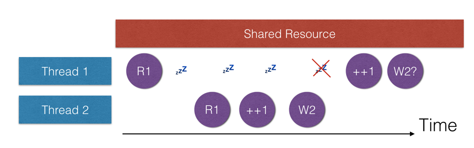
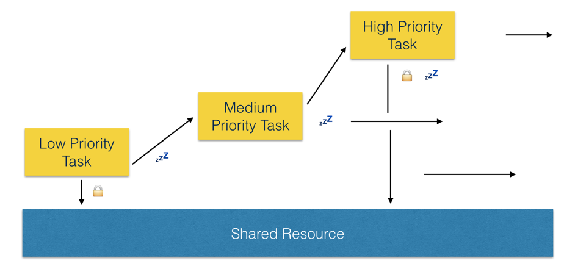
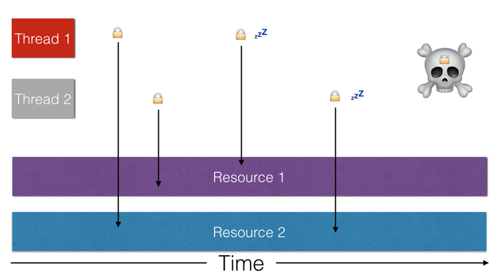
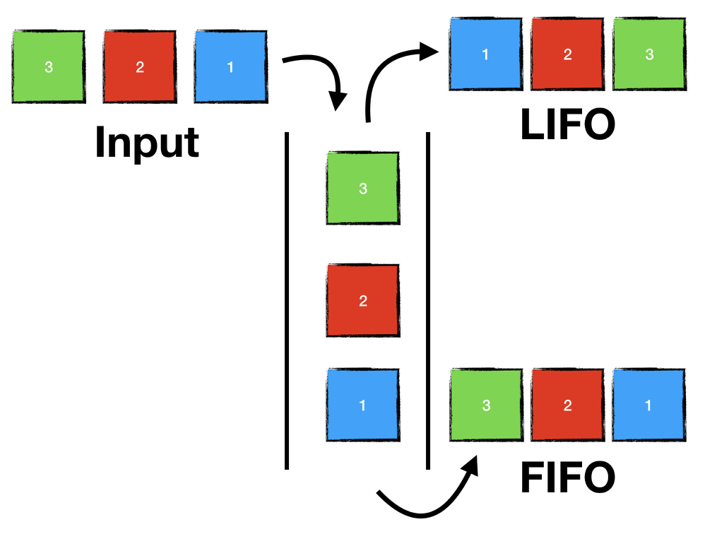
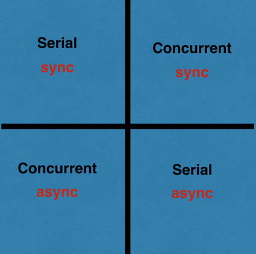

The *Main* Problem
------------------

* The main issue of concurrency arises when we try to do long running tasks on the main thread, which blocks any user interaction. (There are other situations).
* We need to be able to run long running tasks off of the main thread so the interface remains responsive.
* We would also like to be able to break up expensive tasks so that they can run concurrently.

Some Concepts/Terminology
-------------------------

* When code executes the path of execution is singular. (What does this mean?)
* **Threads** allow the OS and our apps to have multiple separate paths of execution.
* This means we can run tasks at the same time.
* Every line of code runs on *some thread*.
* You will almost never want to deal *directly* with threads in iOS because dealing with threads directly is incredibly complex.
* Instead you will use either the C API *GCD* (Grand Central Dispatch) or (NS)OperationQueue to interact *indirectly* with threads by using queues.

3 Threading Problems
--------------------

* There are 3 infamous problems that can arise when dealing directly with threads.
* These can also arise when dealing with Queues.

### 1) Race Conditions

- Can happen when 2 or more threads try to *modify* a shared resource.



- Hard to debug because probabilistic. (It causes *intermittent weirdness*).

- Traditional solution: *lock* the shared resource while it is being mutated.

- Locks prevent another process from writing to it until the first process is finished. (atomic)

- Serial Q's are a better solution than locks when you have different threads writing to the same resource (more on serial vs concurrent Q's below).

### 2) Priority Inversion

- When a lower priority task preempts a higher priority task.



- GCD solves this by boosting the priority of lower priority tasks to speed them up.

### 3) Dead Lock

- When two threads never execute because they are both waiting for the other to release a shared resource.



- This is why solving race conditions using locks can be problematic. (Locks can lead to dead lock).

- Better to use Serial Q's when writing to shared resources from different Q's.

More Terminology
----------------

* Concurrency allows us to run multiple paths of execution at the same time.
* Single core devices do this by task switching very quickly.
* Since 2011 iPad and iPhone have been multicore which allows *true* concurrency.
* [Here's](http://blakespot.com/ios_device_specifications_grid.html) a table of CPU's found on iOS devices.
* Instead of dealing directly with threads GCD/(NS)OperationQueue use queues.
* Queues are not the same thing as threads.
* Queues are abstractions that employ/use threads.
* Queues are used to execute *blocks/closures*.
* Queues can be *serial* or *concurrent*.
* A *serial queue* **executes** blocks FIFO.



* Serial queues wait until the currently executed block completes before the next block is executed.
* A *concurrent queue* **dequeues** (starts) blocks in a FIFO manner.
* The execution of blocks on a concurrent queue happen on different underlying threads concurrently (depending on “resources”).
* Concurrent queues do not wait for the currently dequeued block to return before executing the next one in contrast to serial queues. They dequeue in FIFO order (same as serial queues), but the dequeue immediately (unlike serial queues).
* This means the completion of blocks on a concurrent queue is essentially random. Never rely on the order of completion.
---

* **Main Queue:**
  * The main queue is the interface queue.
  * The main queue uses the applications *main thread*.
  * The main queue is where all interface interaction events are received (like touch events).
  * **When your app interacts with the view it *must* do so on the main queue.**
  * This is because the main queue is ***not* *thread safe***. (What does it mean to be “thread safe”?)
  * Example of tapping a button
    * Touch event arrives on main thread.
    * Button’s action runs on the main thread.
    * No other interface events can be handled while this is happening.
    * Once the code finishes running, the main thread is again ready to receive events or run code.
  * The main thread is **blocked** *while your code runs on it, and this can make the interface unresponsive if your code is a time hog.
  * You need to worry about creating background queues in at least 2 situations
    * 1\. Your code does something that ***might*** take a long time. (Even if you have a fast network and you’re not doing an expensive request, why should you ***never ever*** do a network request on the main Q?)
    * 2\. Some framework/library you’re using calls you back on a background queue. E.g. (NS)URLSession calls you back on a background queue.
      * So, you must get a reference to the main queue in order to update the view.
      * Note: only come back to the main queue at the moment you need to update the interface, not before.
---
* We have 2 types of queues: 1\. concurrent and 2\. serial queues.
* We also have 2 types of execution: 1\. sync and 2\. async.
* You can run an async task on a concurrent or serial Q.
* sync/async tells you whether the current Q you're calling from needs to wait for the task to complete before continuing.
* serial/concurrent tells you whether a Q you're executing code on has only a single thread or it uses many threads (whether it can run only 1 or many tasks simultaneously).
* sync/async is about what happens to the execution of code at the source of the task or the caller (does it wait or keep moving).
* concurrent/serial is about the actual execution of the task (does it execute serially ie, on 1 thread, or concurrently on multiple threads).



### (NS)OperationQueue Vs GCD

* Apple offers three different API’s for concurrency: C GCD, Swift GCD wrapper and (NS)OperationQueue.
* (NS)OperationQueue is an OO wrapper around GCD available in Swift and Objc.
* Swift 3+ adds a struct based wrapper around GCD.
* For simple concurrency you will most likely use GCD (called DispatchQueue in Swift >= 3).
* Use (NS)OperationQueue if:
  * You need to do more complex concurrency, like communicating between tasks, and monitoring execution.
  * You need your concurrent operations to be objects (Objc). (Why might you need to do this?)
  * You need to cancel operations, or you need other kinds of control, like scheduling.
  * You need to be notified about the state of operations. ((NS)OperationQueue uses KVO).
* I will focus on GCD (C API in Objc, DispatchQueue Swift 3+). You will mostly use GCD in day to day iOS coding.
* I will also show a couple of simple examples of (NS)OperationQueue.

### Creating Or Getting Queues in GCD:

* Note: To see everything GCD can do a search in **Dash** with *“dispatch”* with ObjC selected as the language.
* 2 ways to get a queue:
  * 1) User created (named).
  * 2) System created (global).
* You are rarely going to use the first option in Objc (can’t control the priority), but Swift 3+ has made user created Q's a much more useful option.
* User created background queues look like this:

```swift

// C Definition of User Created Q's
dispatch_queue_t dispatch_queue_create( const char *label, dispatch_queue_attr_t attr);

// Creation Objc
dispatch_queue_t userCreatedBackgroundQ1 = dispatch_queue_create("com.lighthouse.threading.1", DISPATCH_QUEUE_CONCURRENT);

dispatch_queue_t userCreatedBackgroundQ2 = dispatch_queue_create("com.lighthouse.threading.2", DISPATCH_QUEUE_SERIAL);

// Creation Swift 1.x + 2.x

let userCreatedBackgroundQ1: dispatch_queue_t  = dispatch_queue_create("com.lighthouse.threading.1", DISPATCH_QUEUE_CONCURRENT);

let userCreatedBackgroundQ2: dispatch_queue_t = dispatch_queue_create("com.lighthouse.threading.2", DISPATCH_QUEUE_SERIAL);

// Creation Swift 3+

let bgQ1 = DispatchQueue(label: "com.steve.queue") // serial by default

let bgQ2 = DispatchQueue(label: "com.steve.queue", qos: .userInitiated, attributes: .concurrent)

```

* Apple has added QOS to the GCD Swift 3+ API.
* I will return to QOS below.

* **System created (vs user created)** queues are **the one you will mostly use**:

```swift

// Objc Definition
dispatch_queue_t dispatch_get_global_queue( long identifier, unsigned long flags);

// Objc Creation
dispatch_queue_t sysCreatedbackgroundQ1 = dispatch_get_global_queue(QOS_CLASS_USER_INTERACTIVE, 0);

// Swift 1.x + 2.x Creation
let sysCreatedbackgroundQ1: dispatch_queue_t = dispatch_get_global_queue(QOS_CLASS_USER_INTERACTIVE, 0);

// Swift 3+
let userInitiatedQOS = DispatchQueue.global(qos:.userInitiated)
let userInteractiveQOS = DispatchQueue.global(qos:.userInteractive)
let defaultQOS = DispatchQueue.global() // qos is .default
let utilityQOS = DispatchQueue.global(qos:.utility)
let backgroundQOS = DispatchQueue.global(qos:.background)
let unspecifiedQOS = DispatchQueue.global(qos:.unspecified)

```

* dispatch\_queue\_t is the return type ( \_t is the way C indicates this is a type).
* dispatch\_get\_global\_queue() takes 2 parameters.
* Always pass 0 for the second param (it’s reserved for future use).
* The first param is an enum value that specifies the relative priority, called *Quality Of Service (QOS).*
* There are 4 possible options in Objc:

 1\. QOS\_CLASS\_USER\_INTERACTIVE // highest priority

 2\. QOS\_CLASS\_USER\_INITIATED // high priority, used when user initiates an action

 3\. QOS\_CLASS\_UTILITY // used for long running tasks

 4\. QOS\_CLASS\_BACKGROUND // used when user doesn’t need result

* Swift 3+ adds *unspecified* to the QOS.

### You can get ahold of the main queue like this:

```swift

// Getting Ref To Main Queue Objc
dispatch_queue_t mainQ = dispatch_get_main_queue();

// Getting Ref To Main Queue Swift 1.x + 2.x
let mainQ2: dispatch_queue_t = dispatch_get_main_queue();

// Swift 3
let mainQ3 = DispatchQueue.main


```

### Adding Tasks To Queues in GCD:

```swift

// C Definition
void dispatch_async( dispatch_queue_t queue, dispatch_block_t block);

// Objc Example
dispatch_queue_t backgroundQ1 = dispatch_get_global_queue(QOS_CLASS_USER_INTERACTIVE, 0);

dispatch_async(backgroundQ1, ^{
    printf("%d: 1\n", __LINE__);
});
printf("%d: 2\n", __LINE__);

// Swift 1.x + 2.x Example

let backgroundQ1: dispatch_queue_t = dispatch_get_global_queue(QOS_CLASS_USER_INTERACTIVE, 0);

dispatch_async(backgroundQ1){
    print(#line, "1")
}
print(#line, "2");

// Swift 3+

DispatchQueue.global(qos:.userInteractive).async {
  print(#line, "3")
}

print(#line, "4")

```

* `dispatch_async` takes 2 paramaters: the queue and the block to dispatch
* `dispatch_async` returns _immediately_
* `dispatch_sync` does not return until the block has run
* You will almost never use `dispatch_sync` except in very advanced situations. (Don't try to handle dependencies using `dispatch_sync`. (Use (NS)OperationQueue instead).
* `dispatch_once` is used to execute a block only once during the lifetime of the app.
* `dispatch_once` is used in the singleton pattern in Objc.

```swift

// C Definition 
void dispatch_once( dispatch_once_t *predicate, dispatch_block_t block);

// Objc Creation
static dispatch_once_t onceToken = 0;  

// This waits for completion
dispatch_once(&onceToken, {
    printf("this will only execute once")
});

dispatch_once(&onceToken, {
    printf("this will never execute!")
})

// Swift 1.x + 2.x Creation

var onceToken: dispatch_once_t = 0;

// This waits for completion
dispatch_once(&onceToken, {
    print("this will only execute once")
});

dispatch_once(&onceToken, {
    print("this will never execute!")
})

// NB. xCode includes a code snippet with this.

// Swift 3?

???

```

Never Do This
-------------

* Never call sync on a background Q. Why?

```swift
// Swift 3+

// Wrong

DispatchQueue.global().sync {
    print("💀")
}

// Right

DispatchQueue.global().async {
    print("💀")
}
```

* Never call sync on the mainQ since this will deadlock.

```swift
// Swift 3+

// Wrong
DispatchQueue.main.sync {
    print("☠️")
}

// Right
DispatchQueue.main.async {
    print("☠️")
}
```

```swift
// indicator is a reference to a UIActivityIndicatorView

indicator.startAnimating()

// Runs after 1 second on the main queue.
DispatchQueue.main.asyncAfter(deadline: .now() + .seconds(1) ) { 
    indicator.stopAnimating()
}

// For the time .seconds(Int), .microseconds(Int) and .nanoseconds(Int) may also be used.

```

Resources:
----------

* objc.io whole edition: <https://www.objc.io/issues/2-concurrency/>
* Apple's guide: <https://developer.apple.com/library/content/documentation/General/Conceptual/ConcurrencyProgrammingGuide/Introduction/Introduction.html>


